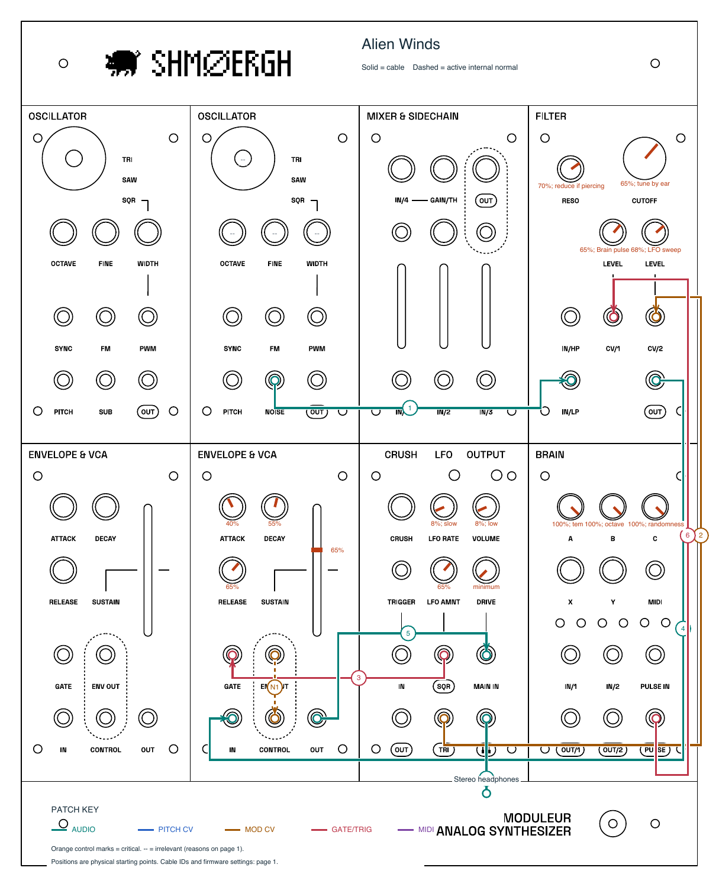

# Patch something strange

Start with a bass groove, a storm, or a conversation, then follow your ears.
[Bass Melody](bass-melody/patch.pdf) brings a weighty saw-and-sub pulse;
[Alien Winds](alien-winds/patch.pdf) breathes and whistles;
[Alien Thunder](alien-thunder/patch.pdf) cracks and rumbles;
[Autonomous Argumentative](autonomous-argumentative/patch.pdf) chirps back at itself.

[](alien-winds/patch.pdf)

*Follow Alien Winds as drawn, or swap its filter modulation sources for a different kind of weather. Click the sheet for setup and variations.*

## Play a patch

Open its PDF. Read the setup on page one, connect the numbered cables on page two,
and start with output volume low. Solid lines are physical cables; dashed lines
are built-in connections. Crossings are not junctions.

Orange marks show the critical controls. Percentages are starting positions along
a knob or slider's travel, so adjust by ear. Check the Brain firmware and mode on
page one before starting a sequenced patch.

Print with fit-to-page for A4 or Letter, or keep the PDF beside the instrument.

## Capture your own sound

Open the repository in Codex and use the
[Moduleur patch skill](../.agents/skills/moduleur-patches/SKILL.md):

> Use $moduleur-patches to create a slow evolving bass patch using Le Controlleur
> in Sequencer mode. Show every cable, active internal connection, and critical
> control, with setup and performance guidance on the first page.

To revise a patch, describe the changed cables or controls and ask Codex to
regenerate it. To use the skill in another project, copy the `moduleur-patches`
folder into that project's `.agents/skills/` directory.

## Build a patch sheet

Install Python 3.10+ and set up the PDF dependencies from the repository root:

```sh
python -m venv .venv
# macOS/Linux:
. .venv/bin/activate
# Windows PowerShell:
# .venv\Scripts\Activate.ps1
python -m pip install -r patches/requirements.txt
```

Use `python3` or Windows `py -3` to create the environment if needed.
Download the blank sheet with `./downloads/refresh.sh` (Git Bash or WSL on
Windows), or save the official
[patch-sheet PDF](https://www.shmoergh.com/content/files/2026/02/moduleur-patch-sheet.pdf)
to `downloads/patchsheets/moduleur-patch-sheet.pdf`.

```sh
python patches/build.py alien-winds
```

The result is saved alongside the definition:

| File | Use |
| --- | --- |
| `patch.json` | Edit the sound, wiring, controls, and firmware settings |
| `patch.pdf` | Read or print the guide and annotated panel |
| `overlay.svg` / `overlay.pdf` | Reuse the vector markings separately |

Run `python patches/build.py` to rebuild all patches. Once the dependencies and
blank sheet are present, builds work offline on macOS, Linux, and Windows.

To check a definition without the PDF dependencies:

```sh
python patches/build.py alien-winds --validate
```

For another first-page style:

```sh
python patches/build.py alien-winds --style editorial
```

Choose `minimal` (default), `classic`, `editorial`, `archive`, or `industrial`.
Alternate styles produce `patch-STYLE.pdf`; cable positions stay the same.
Commit the definition, overlays, and default `patch.pdf`. Alternate style
previews and downloaded blank sheets are ignored by Git.

## Edit by hand

Copy an existing `patch.json` into `patches/<new-name>/`, update its identity,
description, connections, controls, and Brain settings, then build it.
Use the [format reference](../.agents/skills/moduleur-patches/references/format.md)
for fields and the [panel map](../.agents/skills/moduleur-patches/references/panel.json)
for port IDs and coordinates. Cable routes accept `via` points and `label_at`
positions to keep the drawing legible.

Include every active cable and internal connection. An input cannot be both
patched and internally connected; declare a splitter when one output feeds two
physical cables. Give each control on a used module a position or a reason it
has no effect. Keep connection IDs stable when revising a patch.

Record the Brain's firmware, version, mode, and operating settings. Le Controlleur
uses `Sequencer` or `MIDI to CV`. The `three-knobs-two-buttons` layout maps X/Y/Z
to the upper knobs from left to right; use `settings-inset` for an unmapped layout.
In MIDI-to-CV mode, describe stored settings and how to configure them.

## Check and share

Inspect both PDF pages for clear cable endpoints, readable controls, and correct
firmware settings. Try the patch on the instrument before marking its definition
`auditioned`; start new patches as `untested`.

Validation checks port directions, duplicate inputs, control coverage, modes,
and page overflow. The renderer checks the blank sheet's SHA-256 hash to prevent
misaligned overlays. If the official drawing changes, update the panel map and
hash together after inspecting it.

Keep attribution on the finished sheet: the panel artwork is Shmoergh's;
the patch description and overlay are community-authored. For independent
merging, align the overlay at the original PDF's top-left corner without scaling.

To refresh the README preview after changing Alien Winds (requires Poppler):

```sh
pdftoppm -f 2 -l 2 -singlefile -scale-to 1500 -png \
  patches/alien-winds/patch.pdf patches/alien-winds/preview
```
